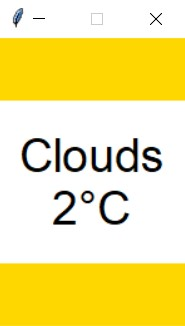
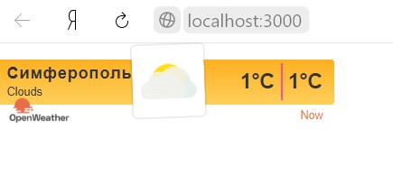

<p align="center">МИНИСТЕРСТВО НАУКИ  И ВЫСШЕГО ОБРАЗОВАНИЯ РОССИЙСКОЙ ФЕДЕРАЦИИ<br>
Федеральное государственное автономное образовательное учреждение высшего образования<br>
"КРЫМСКИЙ ФЕДЕРАЛЬНЫЙ УНИВЕРСИТЕТ им. В. И. ВЕРНАДСКОГО"<br>
ФИЗИКО-ТЕХНИЧЕСКИЙ ИНСТИТУТ<br>
Кафедра компьютерной инженерии и моделирования</p>
<br>
<h3 align="center">Отчёт по лабораторной работе № 1<br> по дисциплине "Программирование"</h3>
<br><br>
<p>студента 1 курса группы ПИ-б-о-201(1)<br>
Кривошапко Михаила Игоревича<br>
направления подготовки 09.03.04 "Программная инженерия"</p>
<br><br>
<table>
<tr><td>Научный руководитель<br> старший преподаватель кафедры<br> компьютерной инженерии и моделирования</td>
<td>(оценка)</td>
<td>Чабанов В.В.</td>
</tr>
</table>
<br><br>
<p align="center">Симферополь, 2020</p>
<hr>

## Постановка задачи

Разработать сервис предоставляющий данные о погоде в городе Симферополе на момент запроса.  В качестве источника данных о погоде используйте: http://openweathermap.org/. В состав сервиса входит: серверное приложение на языке С++ и клиентское приложение на языке Python.

Серверное приложение (далее Сервер) предназначенное для обслуживания клиентских приложений и минимизации количества запросов к сервису openweathermap.org. Сервер должен обеспечивать возможность получения данных в формате JSON и виде html виджета (для вставки виджета на страницу будет использоваться iframe).

Клиентское приложение должно иметь графический интерфейс отображающий сведения о погоде и возможность обновления данных по требованию пользователя.

## Цель работы
Целью работы является научится создавать приложения с клиент-серверной архитектурой.

Каталоги:
[[Сервер]](./server(C++)) [[Клиент]](./client(Python))
## Выполнение работы

Первым шагом было изучение API из сервиса openweathermap и библиотеки time. Была прочитаны и созданы требуемые запросы.

Следующим шагом был разработан c++ сервер с вкраплениями python.

Файл [ConsoleApplication1.cpp](./server(C++)/ConsoleApplication1/ConsoleApplication1/ConsoleApplication1.cpp) содержит функцию входа *main*.

Проект имеет несколько существенных изъянов, однако их планируется исправить в ближайшие сроки.

### Информация о проекте

Для разработки сервера былb использованы: IDE Visual Studio 2017 15.9.27 (С++), IDE Spyder реализации Anaconda для Windows(Python 3.8.3)
Для разработки клиента была использована IDE Spyder реализации Anaconda для Windows(Python 3.8.3)
### Обязательная информация

1. На сайте openweathermap.org был получен следующий ключ api: **a50134af28c2718b67c6f87a3f126eef**
2. Был составлен следующий запрос: http://api.openweathermap.org/data/2.5/find?q=Simferopol,UA&type=like&APPID=a50134af28c2718b67c6f87a3f126eef
3. Для пункта 2 был использован метод localetime(), контактирующий с API сервисов всемирного времени, из библиотеки time языка Python
4. Полный исходный код сервера:
```c++
//ConsoleApplication1
#include <iostream>
#include <fstream>
#include "include/cpp_httplib/httplib.h"
#include <string>
using namespace httplib;
//using namespace fstream;
//using namespace string;

// В этой функции формируем ответ сервера на запрос
void gen_response(const Request& req, Response& res) {
	system("..\\ConsoleApplication1\\supscripts\\jsonrework.py");
	std::string path1 = "..\\ConsoleApplication1\\WidgetPage.html"; //server(C++)\\ConsoleApplication1\\ConsoleApplication1\\.
	std::string path2 = "WidgetPage.html";
	std::ifstream fin1, fin2;
	fin1.open(path1);
	fin2.open(path2);
	char ch;
	std::string htmlres1 = "";
	if (!(fin1.is_open())) {
		std::cout << "no connection";
	}
	else {
		while (fin1.get(ch)) {
			htmlres1 += ch;
		}
	}
	std::string htmlres2 = "";
	if (!(fin2.is_open())) {
		std::cout << "no connection";
	}
	else {
		while (fin2.get(ch)) {
			htmlres1 += ch;
		}
	}	
	if (htmlres1 != "") {
		res.set_content(htmlres1, "text/html");
	}
	else {
		res.set_content(htmlres2, "text/html");
	}
	fin1.close();
	fin2.close();
}

int main() {
	Server svr;                    // Создаём сервер (пока что не запущен)
	svr.Get("/", gen_response);    // Вызвать функцию gen_response если кто-то обратится к корню "сайта"
	std::cout << "Start server... OK\n";
	svr.listen("localhost", 3000); // Запускаем сервер на localhost и порту 3000
}
```
```py
#jsonrework.py
# -*- coding: utf-8 -*-
import json as js
import requests as req
from os import startfile

inp = req.get("http://api.openweathermap.org/data/2.5/find?q=Simferopol,UA&type=like&APPID=a50134af28c2718b67c6f87a3f126eef")
JSONData = inp.json()

if __name__ != "__main__":
    with open(r"..\server(C++)\ConsoleApplication1\ConsoleApplication1\supscripts\PublicData.json", "w") as f:
        js.dump(JSONData, f)
else:
    with open(r"PublicData.json", "w") as f:
        js.dump(JSONData, f)
        
# with open("PublicData.json", "r") as read_file:
#     UnpackData = js.load(read_file)

weather = JSONData["list"][0]["weather"][0]["main"]
temperature = JSONData["list"][0]["main"]["temp"] - 273.15

if __name__ != "__main__":
    with open(r"..\server(C++)\ConsoleApplication1\ConsoleApplication1\supscripts\PDataCash.txt", "w") as f:
        print(weather, round(temperature), file=f)
else:
    with open(r"PDataCash.txt", "w") as f:
        print(weather, round(temperature), file=f)
        
startfile("widgetparser.py")
```
```py
#widgetparser.py
# -*- coding: utf-8 -*-
from re import sub
from time import localtime

with open("WidgetPage.txt", "r") as f1, open("PDataCash.txt", "r") as f2:
    widg = f1.readlines()
    repldat = f2.readline()

x = localtime()
widg = "".join(widg)
widg = sub(r"%", repldat.split()[0], widg, count=1)

if repldat.split()[0].lower() == r"clouds":
    if x.tm_hour >= 21 or x.tm_hour < 5:
        widg = sub(r"%", r"3n", widg, count=1)
    else:
        widg = sub(r"%", r"3d", widg, count=1)
elif repldat.split()[0].lower() == r"clear":
    if x.tm_hour >= 21 or x.tm_hour < 5:
        widg = sub(r"%", "1n", widg, count=1)
    else:
        widg = sub(r"%", "1d", widg, count=1)
else:
    if x.tm_hour >= 21 or x.tm_hour < 5:
        widg = sub(r"%", "4n", widg, count=1)
    else:
        widg = sub(r"%", "4d", widg, count=1)
        
widg = sub(r"%", repldat.split()[1], widg, count=1)
widg = sub(r"%", repldat.split()[1], widg, count=1)

with open("PublicData.json", "r") as f:
    dat = f.readlines()
    dat = "".join(dat)
    widg = sub(r"%", dat, widg, count=1)

with open("WidgetPage.html", "w") as f:
    print(widg, file=f)

with open(r"..\WidgetPage.html", "w") as f: #..\server(C++)\ConsoleApplication1\ConsoleApplication1\ ||||C:\\Users\\Михондрус\\myGitRepoCloned\\Programming\\Lab\\01\\server(C++)\\ConsoleApplication1\\ConsoleApplication1\\
    print(widg, file=f)
```
5. Полный код Клиента:
```py
#MainClient.py
import tkinter as tk
import requests
# import time
import json
# from threading import Thread
# from os import startfile

# now = time.time()

def get_res():
    res = requests.get(r"http://localhost:3000")
    res = res.text.split('\n')
    cashfile = json.loads(res[43])
    return cashfile

# def timecheck():
#     while True:
#         if time.time() >= now + 10:
#             startfile(r"MainClient.pyw")
#             exit(0)
#         else:
#             time.sleep(1)
#             return

JSONData = get_res()
weather = JSONData["list"][0]["weather"][0]["main"]
temperature = round(JSONData["list"][0]["main"]["temp"] - 273.15)

window = tk.Tk()
window.geometry('150x230')
window.resizable(width=False, height=False)

x = (window.winfo_screenwidth() - window.winfo_reqwidth()) / 2
y = (window.winfo_screenheight() - window.winfo_reqheight()) / 2
window.wm_geometry("+%d+%d" % (x, y))

frame1 = tk.Frame(master=window, width=50, height=50, bg="gold")
frame1.pack(fill=tk.BOTH, side=tk.TOP)
 
frame3 = tk.Frame(master=window, width=50, height=50, bg="gold")
frame3.pack(fill=tk.BOTH, side=tk.BOTTOM)

# with open("PublicData.json", "r") as f:
#     jsonData = f.readline()

label = tk.Label(
    text=f"{weather}\n" + f"{temperature}°C",
    fg="black",
    bg="white",
    font="Arial 28",
    width=5,
    height=3
)
label.pack(fill=tk.BOTH, side=tk.TOP)

# if __name__ == '__main__':
window.mainloop()
    # Thread(target=timecheck()).start()
```
6. Скриншот клиентского приложения:



Рисунок 1. Графический интерфейс программы-клиента.

7. Скриншот браузерного виджета:



Рисунок 2. HTML-виджет на local-hostе.

Каталоги:
[[Сервер]](./server(C++)) [[Клиент]](./client(Python))
## Вывод
Были выполнены поставленные задачи, а также формально достигнута цель данной работы - была произведена разработка клиент-серверного приложения позволяющего узнать погоду в Симферополе на текущий момент времени, однако программа все еще требует некоторой доработки.

Разработка сервера была выполнена с использованием сторонних библиотек: cpp-httplib для работы с http запросами, json для работы с JSON файлами, re для работы с заменой шаблонных строк, time для работы со временем. Клиент использует такие библиотеки как: requests для отправки запросов, os для работы с файловой системой, tkinter для создания GUI, json для работы с JSON файлами, requests для отправки запросов на сервер.