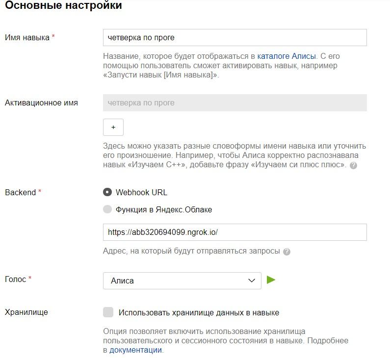
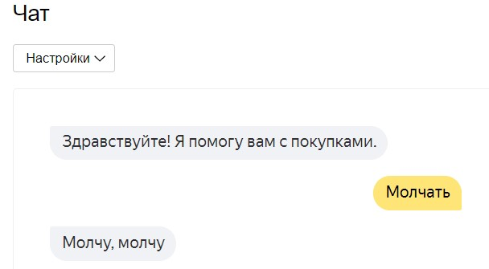
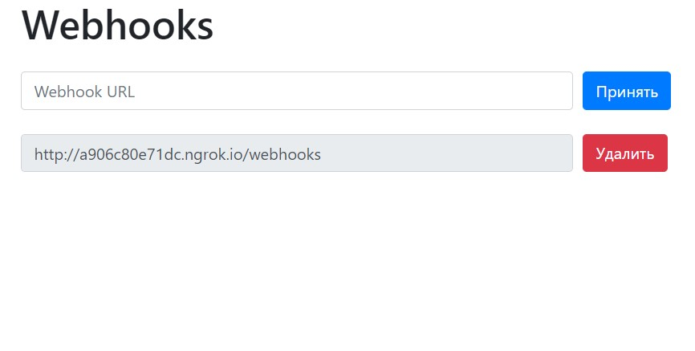

<p align="center">МИНИСТЕРСТВО НАУКИ  И ВЫСШЕГО ОБРАЗОВАНИЯ РОССИЙСКОЙ ФЕДЕРАЦИИ<br>
Федеральное государственное автономное образовательное учреждение высшего образования<br>
"КРЫМСКИЙ ФЕДЕРАЛЬНЫЙ УНИВЕРСИТЕТ им. В. И. ВЕРНАДСКОГО"<br>
ФИЗИКО-ТЕХНИЧЕСКИЙ ИНСТИТУТ<br>
Кафедра компьютерной инженерии и моделирования</p>
<br>
<h3 align="center">Отчёт по лабораторной работе № 2<br> по дисциплине "Программирование"</h3>
<br><br>
<p>студента 1 курса группы ПИ-б-о-201(1)<br>
Кривошапко Михаила Игоревича<br>
направления подготовки 09.03.04 "Программная инженерия"</p>
<br><br>
<table>
<tr><td>Научный руководитель<br> старший преподаватель кафедры<br> компьютерной инженерии и моделирования</td>
<td>(оценка)</td>
<td>Чабанов В.В.</td>
</tr>
</table>
<br><br>
<p align="center">Симферополь, 2020</p>
<hr>

## Постановка задачи

Разработайте и зарегистрируйте навык для Алисы на сервисе Яндекс.Диалоги;
В качестве backend-a для навыка реализуйте приложение на языке С++ выполняющее следующие функции:
Составление продуктовой корзины: Добавление продукта в корзину; Удаление продукта из корзины; Очистка корзины; Вывод списка товаров в корзине; Подсчёт стоимости товаров в корзине.
Вывод справочной информации по навыку;
Регистрацию webhook-ов сторонних сервисов;
Отправку данных на сторонние сервисы. 
В качестве стороннего сервиса реализуйте приложение на языке Python выполняющее следующие функции:
Ожидание данных о покупке; Сохранение поступивших данных в excel-документ. Подробности указаны далее.
## Цель работы
Цель: Получить представления о структуре post-запроса, изучить webhooks как метод взаимодействия web-приложений;
Каталоги:
[[Сервер]](./server(C++)) [[Клиент]](./client(Python))
## Выполнение работы

Первым шагом было изучение Webhook'ов. Была прочитаны и созданы требуемые запросы.

Следующим шагом был разработан c++ сервер со вставками python.

Файл [ConsoleApplication11.cpp](./server(C++)/ConsoleApplication11/ConsoleApplication11/ConsoleApplication11.cpp) содержит функцию входа *main*.

Проект имеет несколько существенных изъянов, однако их планируется исправить в ближайшие сроки.

### Информация о проекте
Стандарт С++: С++20
Для разработки сервера были использованы: IDE Visual Studio 2017 15.9.27 (С++), IDE Spyder реализации Anaconda для Windows(Python 3.8.3)
Для разработкистороннего сервиса была использована IDE Spyder реализации Anaconda для Windows(Python 3.8.3)
### Обязательная информация

1. Скриншот настроек навыка:



Рисунок 1. Выбор настроек .

2, 3. Скриншот "корзины", "молчать":



Рисунок 2. Демонстрация команд.

4. Скриншот браузерного виджета вебхуков:



Рисунок 3. HTML-виджет вебхуков.

5. Ссылка на таблицу результатов запросов:

[[Excel]](./excel)

6. Полный исходный код сервера:
```c++
#include <iostream>
#include <string>
#include "include/cpp_httplib/httplib.h"
#include <fstream>

std::ofstream logger("log.txt");
using namespace httplib;

/*
#include <iostream>
#include "include/cpp_httplib/httplib.h"
using namespace httplib;

int main() {
	// Создаём клиент и привязываем к домену. Туда пойдут наши запросы
	Client cli("http://webhook.site");
	// Отправляем post в теле которого будет текст {"Hello": "world"}
	auto res = cli.Post("/6ef5a6b1-be3c-4dae-8f1d-16f6f94d6620", R"({"Hello": "world"})", "text/json");
	// res преобразуется в true, если запрос-ответ прошли без ошибок
	if (res) {
		// Проверяем статус ответа, т.к. может быть 404 и другие
		if (res->status == 200) {
			// В res->body лежит string с ответом сервера
			std::cout << res->body << std::endl;
		}
		else {
			std::cout << "Status code: " << res->status << std::endl;
		}
	}
	else {
		auto err = res.error();
		std::cout << "Error code: " << err << std::endl;
	}
}
*/
// В этой функции формируем ответ сервера на запрос

void gen_get1response(const Request& req, Response& res) {
	system(u8"..\\ConsoleApplication11\\whpedito.py");
	std::cout << "0\n";
	std::string path1 = u8"..\\ConsoleApplication11\\webhooksfinal.html"; // ..\\ConsoleApplication11\\ConsoleApplication11
	std::string pathjsonwork = u8"..\\ConsoleApplication11\\config.txt"; //data:text/html,<form action=http://localhost:1234 method=post><input name=key></form>
	std::ifstream fin1;
	std::ofstream fout1(pathjsonwork, std::ios::app);
	std::cout << "3\n";
	fin1.open(path1);
	char ch;
	std::string htmlres1 = "";
	if (req.method == "POST" && fout1) {
		std::string x;
		x = req.body.c_str();
		fout1 << x << '\n';
		system(u8"..\\ConsoleApplication11\\whpedito.py");
	}
	if (!(fin1.is_open())) {
		std::cout << "no connection\n";
	}
	else {
		getline(fin1, htmlres1, '\0');
	}
	if (htmlres1 != "") {
		res.set_content(htmlres1, "text/html");
	}
	fin1.close();
	fout1.close();
}

void gen_get2response(const Request& req, Response& res) {
	// Выводим на экран тело запроса
	std::cout << req.body.c_str();
	// Здесь будет ответ, пока-что взят пример из документации
	std::string str = u8R"({
		"response": {
		"text": "Здравствуйте! Это мы, хороводоведы.",
			"tts" : "Здравствуйте! Это мы, хоров+одо в+еды.",
			"end_session" : false
		},
		"session_state" : {
			"value": 10
			},
			"version" : "1.0"
	})";
	// Отправляем ответ
	res.set_content(str, "text/json; charset=UTF-8");
}

int main() {
	Server svr;                            // Создаём сервер
	svr.Get("/webhooks", gen_get1response);
	svr.Post("/webhooks", gen_get1response);
	svr.Post("/", gen_get2response);// Вызвать функцию gen_response на post запрос
	std::cout << "Start server... OK\n"; // cout использовать нельзя
	svr.listen("localhost", 1234);         // Запускаем сервер на localhost и порту 1234
}

```
```py
#whpedito.py
from json import load, dump, decoder


def precious_thing():
    with open("config.json", "r", encoding="utf-8") as f:
        whs = load(f)

    with open("webhooksfinal.html", "w", encoding="utf-8") as f1, open("webhooks.txt", "r", encoding="utf-8") as f2:
        template = "".join(f2.readlines())
        global cringe
        cringe = str("".join(whs['webhooks'])).split('\n')
        for i in cringe:
            if i[0:3] == "del":
                f0 = open("config.txt", "w", encoding="utf-8")
                f0.close()
                cringe = []
                break
            elif i != '\n' and i != '' and i != ' ':
                res = f"""<div class="form-row align-items-center">
                                <div class="col">
                                  <input type="text" value="{i[4:]}" class="form-control mb-2" disabled>
                                </div>
                                
                                <div class="col">
                                  <button type="submit" name="del" value="{i[4:]}" class="btn btn-danger mb-2">Удалить все</button>
                                </div>
                              </div>"""
                res += "\n{}\n"
                template = template.format(res)
            
        template = template.format("")
        print(template, file=f1)
        
    with open("config.txt", "w", encoding="utf-8") as f:
        print("\n".join(set(cringe)), file=f)
try:
    with open("config.json", "r", encoding="utf-8") as f:
        for i in f.readlines():
            if i != '':
                flag = True
                break
            else:
                flag = False
                break
        flag = True
        
except FileNotFoundError or decoder.JSONDecodeError:
    flag = False
    
    
if flag:
    with open("config.json", "w", encoding="utf-8") as f, open("config.txt", "r", encoding="utf-8") as ff:
        container = ff.readlines()
        Ndictionary = {"webhooks": container for j in range(1)}
        dump(Ndictionary, f)
else:
    # sys.exit() # Оно чудесным образом работает, хотя это вообще необъяснимо. отредачить попозже.
    with open("config.json", "r", encoding="utf-8") as fin:
        old = load(fin)
        
    with open("config.json", "w", encoding="utf-8") as f, open("config.txt", "r", encoding="utf-8") as ff:
        container = str("".join(ff.readlines())).split('\n')
        if set(container) not in set(old["webhooks"]):
            for i in container:
                if i not in old["webhooks"]:
                    old["webhooks"].append(i)
        dump(old, f)

precious_thing()

if __name__ != "__main__":
    with open('log.txt', 'w') as f:
        print("lol", file=f)
```
7. Полный код Клиента:
```py
import json as j
import openpyxl as oxl
from datetime import datetime
from flask import Flask, request
 
app = Flask(__name__)

@app.route('/', methods=['POST', 'GET'])
def index():
    if request.method == 'POST':
        
        global s, r
        s = request.get_json()
        print(s)
        r = j.load(s)
        book = oxl.Workbook()
        sheet = book.active()
        sheet["A1"] = "N"
        sheet["B1"] = "User ID"
        sheet["C1"] = "Datetime"
        sheet["D1"] = "Item"
        sheet["E1"] = "Price"
        
        for i in range(len(r["check"])):
    
            sheet["A" + str(i + 2)] = i + 1
            sheet["B" + str(i + 2)] = r["user_id"]
            sheet["C" + str(i + 2)] = datetime.now()
            sheet["D" + str(i + 2)] = r["check"][i]["item"]
            sheet["E" + str(i + 2)] = r["check"][i]["price"]
            
        book.save("data.xlsx")
        book.close()
        return "Это POST запрос"
    
    if request.method == 'GET':
        print(s)
        return s
 
    """
    # -*- coding: utf-8 -*-
import openpyxl as oxl
from datetime import datetime

book = oxl.Workbook()
sheet = book.active
sheet["A1"] = "N"
sheet["B1"] = "User ID"
sheet["C1"] = "Datetime"
sheet["D1"] = "Item"
sheet["E1"] = "Price"
r = {"user_id": "9359F683B13A18A1", "check":[{"item": "SANDALIANS","price": 250},{"item": "SOCKIANS","price": 100}]}
for i in range(len(r["check"])):
    
    sheet["A" + str(i + 2)] = i + 1
    sheet["B" + str(i + 2)] = r["user_id"]
    sheet["C" + str(i + 2)] = datetime.now()
    sheet["D" + str(i + 2)] = r["check"][i]["item"]
    sheet["E" + str(i + 2)] = r["check"][i]["price"]
    
book.save("data.xlsx")
book.close()
    """
if __name__ == "__main__":
    app.run()
```

Каталоги:
[[Сервер]](./server(C++)) [[Клиент]](./client(Python)) [[Excel]](./Excel)
## Вывод
Были выполнены поставленные задачи, а также формально достигнута цель данной работы - были получены представления о структуре post-запроса, изучены webhooks как метод взаимодействия web-приложений, однако экспериментальная часть лабораторной(программа) все еще требует некоторой доработки.

Разработка сервера была выполнена с использованием сторонних библиотек: cpp-httplib для работы с http запросами, json для работы с JSON файлами. Клиент использует такие библиотеки как: openpyxl для работы с электронными таблицами, os для работы с файловой системой, json для работы с JSON файлами.