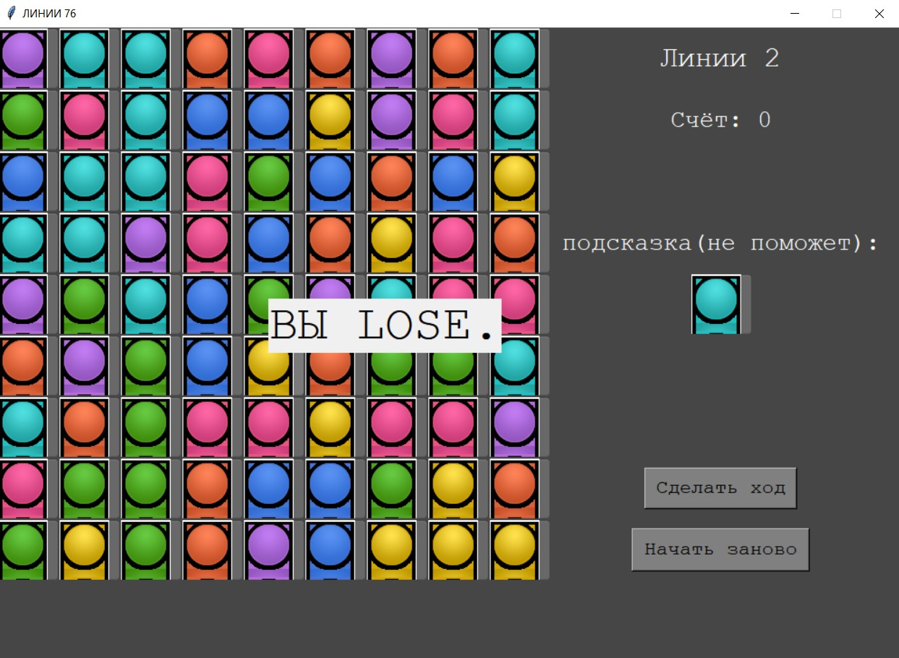

МИНИСТЕРСТВО НАУКИ  И ВЫСШЕГО ОБРАЗОВАНИЯ РОССИЙСКОЙ ФЕДЕРАЦИИ 
Федеральное государственное автономное образовательное учреждение высшего образования 
"КРЫМСКИЙ ФЕДЕРАЛЬНЫЙ УНИВЕРСИТЕТ им. В. И. ВЕРНАДСКОГО" 
ФИЗИКО-ТЕХНИЧЕСКИЙ ИНСТИТУТ 
Кафедра компьютерной инженерии и моделирования

 
<h3 align="center">Отчёт по лабораторной работе № 3  по дисциплине "Программирование"</h3>
  

студента 1 курса группы ПИ-б-о-201(1) 
Кривошапко Михаила Игоревича 
направления подготовки 09.03.04 "Программная инженерия"

  
<table>
<tr><td>Научный руководитель  старший преподаватель кафедры  компьютерной инженерии и моделирования</td>
<td>(оценка)</td>
<td>Чабанов В.В.</td>
</tr>
</table>
  

Симферополь, 2021

## Постановка задачи
Используя стандартный модуль для разработки программ с графическим интерфейсом Tkinter реализуйте игру Lines на зыке Python.
В качестве образца графического интерфейса используйте данную игру.
Подробности указаны далее.
## Цель:
Закрепить навыки разработки программ с простым графическим интерфейсом пользователя на зыке Python при помощи библиотеки Tkinter;
Получить представление о разработке простых игровых приложений.
КОД:
[[игра]](./linesfiles/Lines.py)
## Выполнение работы

В процессе разработки игры придется решить 4 основные задачи:

Удаление всех шариков с игрового поля и установка плиток в невыбранное состояние;
Подсчёт количества свободных плиток на игровом поле и выбор рандомной из них для размещения нового шарика;
Определение наличия ряда шариков одного цвета на игровом поле и их удаления;
Определение наличие пути между двумя плитками на игровом поле.

Я создал класс MARKED_LABEL в котором будет храниться информация о каждой ячейке: есть ли на ней шар, какого цвета шар, ряд, строка
Я сделал функцию showSCORES для обновления игрового счета.
Структура данных actual_game - квадратная матрица девятого порядка, в каждой клетке которой находится MARKED_LABEL. в этой структуре данных происходит вся игра.
функция GAMEcheck: 
1) подсчитывает пустые ячейки и их находит их координаты
2) находит все одноцветные линии длиной >= 5, меняет глобальную переменную result, которая используется в showSCORES
3) если свободных ячеек нет, выводит:"ВЫ LOSE."
функция computerMOVE: совершает ход компьютера: создает три шара рандомного цвета в рандомном свободном месте.
функция MOVEpossibility: проверяет возможность сходить из одной ячейки в другую. В идеале - обход графа в ширину.
функция playerMOVE: если игрок нажал на ячейку с шаром, она загорается, игрок может перенести шар в выбранное им свободное место.
функция createNEWgame: функция, обновляющая состояние игры - удаляет все шары, ставит счет равный нулю, убирает надпись "ВЫ LOSE."
функция showTIP: показывает подсказку (не помогающую).

К сожалению выбранный мною метод вывода изображения шара .paste() сделал из шаров квадраты. На геймплей это не влияет.

Проект имеет несколько существенных изъянов, однако их планируется исправить в ближайшие сроки.

### Информация о проекте
Для разработки игры была использована IDE Spyder реализации Anaconda для Windows(Python 3.8.3)
### Обязательная информация

1. Скриншоты игрового процесса:

Рисунок 1. старт игры.

2.

Рисунок 2. для тех кому лень самому играть.

3.

Рисунок 3. YOU проиграли.

4.

Рисунок 4. Одного шара до линии по диагонали не хватает.

5.

Рисунок 5. линия уничтожена.

7. Полный код Клиента:

Каталоги:
[[Игровые файлы]](./linesfiles)
## Вывод
Были выполнены все поставленные задачи, а также полностью достигнута цель данной работы - были получены навыки разработки программ с простым графическим интерфейсом пользователя на языке Python при помощи библиотеки Tkinter,
получено представление о разработке простых игровых приложений, однако экспериментальная часть лабораторной(программа) все еще требует некоторой доработки.

Разработка сервера была выполнена с использованием сторонних библиотек: tkinter для GUI, random для случайных чисел, copy для создания копий без ссылок на объект, PIL для работы с изображениями.