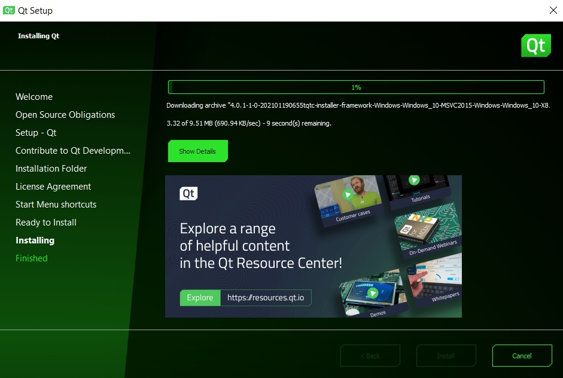
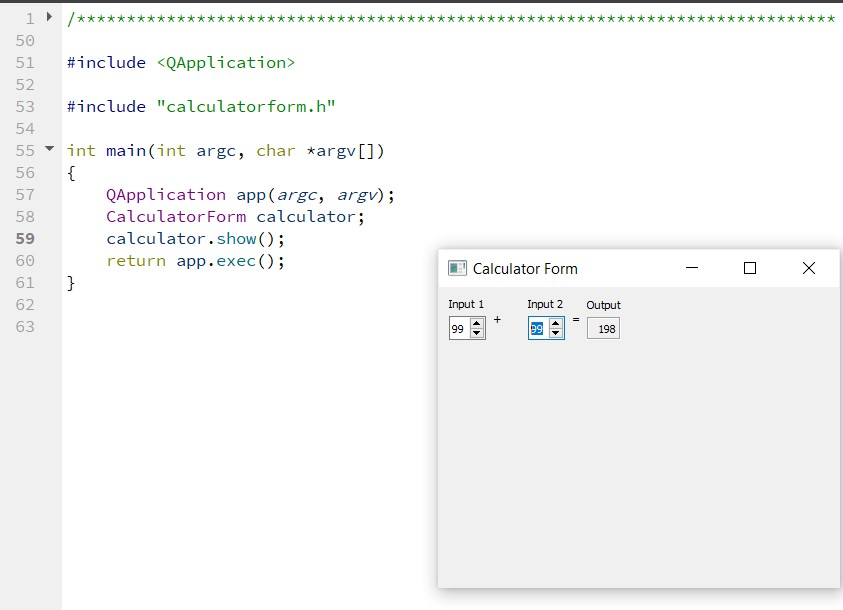
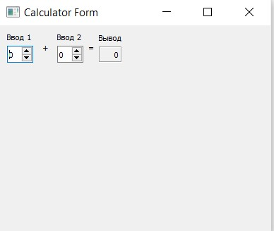

МИНИСТЕРСТВО НАУКИ  И ВЫСШЕГО ОБРАЗОВАНИЯ РОССИЙСКОЙ ФЕДЕРАЦИИ 
Федеральное государственное автономное образовательное учреждение высшего образования 
"КРЫМСКИЙ ФЕДЕРАЛЬНЫЙ УНИВЕРСИТЕТ им. В. И. ВЕРНАДСКОГО" 
ФИЗИКО-ТЕХНИЧЕСКИЙ ИНСТИТУТ 
Кафедра компьютерной инженерии и моделирования

 
<h3 align="center">Отчёт по лабораторной работе № 4  по дисциплине "Программирование"</h3>
  

студента 1 курса группы ПИ-б-о-201(1) 
Кривошапко Михаила Игоревича 
направления подготовки 09.03.04 "Программная инженерия"

  
<table>
<tr><td>Научный руководитель  старший преподаватель кафедры  компьютерной инженерии и моделирования</td>
<td>(оценка)</td>
<td>Чабанов В.В.</td>
</tr>
</table>
  

Симферополь, 2021

## Постановка задачи
Настроить рабочее окружение, для разработки программного обеспечения при помощи Qt и IDE Qt Creator, а также изучить базовые возможности данного фреймворка.
## Цель:
Установить фреймворк Qt;
Изучить основные возможности создания и отладки программ в IDE Qt Creator.

## Выполнение работы

Задание 1

1. Я скачал с официального сайта и установил последнюю стабильную версию фреймворка Qt;

2. В процессе установки выбрал компоненты Qt для сборки при помощи MinGW и подходящую к этим компонентам версию MinGW.

3. Чтобы убедиться, что установка прошла успешно, запустил среду разработки Qt Creator и в разделе Примеры нашел проект Calculator Form Example.

4. Щёлкнув по проекту будет предложено изучить краткую документацию по нему, а так же выбрать и настроить комплект сборки. Выбирал версию под Desktop, после чего щелкнул по кнопке Редактор.

5. На боковой панели в разделе Проекты в каталоге Формы откройте главную форму проекта и замените текст "Input 1", "Input 2", "Output" на "Ввод 1", "Ввод 2" и "Вывод" соответственно. Для этого нужно щёлкнуть по нужному компоненту на форме и в окне Редактор свойств поменять значение свойства text (используйте фильтр).
Скриншот приложения добавьте в отчёт.

Задание 2

Добавьте в отчёт ответы на следующие вопросы. Текст вопросов продублируйте в отчёте:

Как изменить цветовую схему (оформление) среды?

зайти в Инструменты > Внешние > Настроить... > Интерфейс

Как закомментировать/раскомментировать блок кода средствами Qt Creator? Имеется ввиду комбинация клавиш или пункт меню.

ctrl + /

Как открыть в проводнике Windows папку с проектом средствами Qt Creator?

внутри папки нажать на файл с разрешением .pro

Какое расширение файла-проекта используется Qt Creator? Может быть несколько ответов.

.pro, .ui, .pro.user

Как запустить код без отладки?

Нажать на зеленый треугольник без жучка, либо найти в меню Сборка

Как запустить код в режиме отладки?

Нажать на зеленый треугольник с жучком, либо найти в меню Отладка

Как установить/убрать точку останова (breakpoint)?

нажать ЛКМ слева от номера строки.

Задание 3

Создайте консольное приложение без Qt.

Переключите режим сборки в режим Отладка;

Установите точки останова на 6, 7, 8 строках;

Выполните программу в режиме отладки;

В отчёт добавьте ответы на вопросы:

Чему равны переменные i и d в 6 строке: 0 и 7.0293920979219197e-317;
Чему равны переменные i и d в 7 строке: 5 и 7.0293920979219197e-317;
Чему равны переменные i и d в 8 строке: 5 и 5;

Задание 4
Начиная работать с новым инструментом важно не забыть настроить git, а точнее файл .gitignore, чтобы в репозиторий не попадал всякий мусор.
Я его настроил.

### Информация о проекте
Для лабораторной работы была использована Qt Creator MinGW5 для Windows.
### Обязательная информация

5. Скриншоты:

Рисунок 1. Установка Qt.

Рисунок 2. Неизмененная форма калькулятора.

Рисунок 3. Измененная форма калькулятора.

Каталоги:
[[Файлы]](./3 zadanie)
## Вывод
Были выполнены все поставленные задачи, а также полностью достигнута цель данной работы - были получены первичные навыки разработки программ с простым графическим интерфейсом пользователя  при помощи фреймворка Qt,

Разработка была выполнена с использованием сторонних библиотек: <QApplication>, "calculatorform.h".