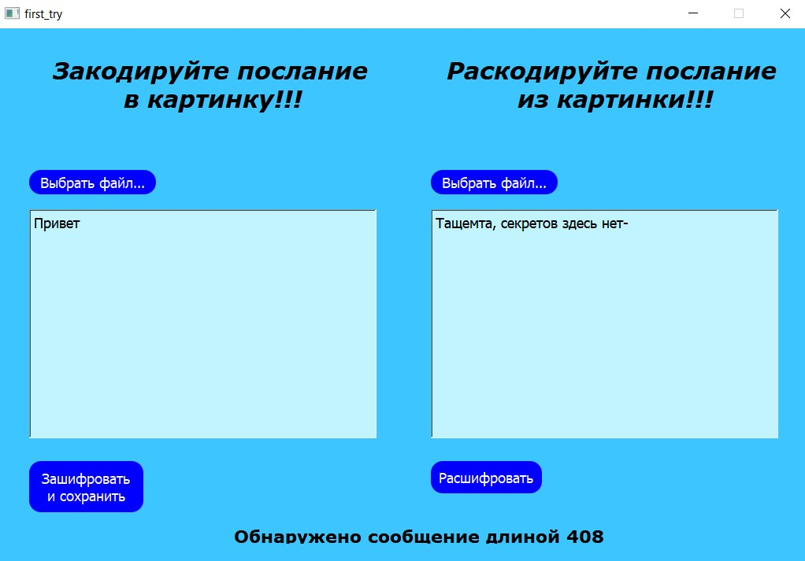

МИНИСТЕРСТВО НАУКИ  И ВЫСШЕГО ОБРАЗОВАНИЯ РОССИЙСКОЙ ФЕДЕРАЦИИ 
Федеральное государственное автономное образовательное учреждение высшего образования 
"КРЫМСКИЙ ФЕДЕРАЛЬНЫЙ УНИВЕРСИТЕТ им. В. И. ВЕРНАДСКОГО" 
ФИЗИКО-ТЕХНИЧЕСКИЙ ИНСТИТУТ 
Кафедра компьютерной инженерии и моделирования

 
<h3 align="center">Отчёт по лабораторной работе № 5  по дисциплине "Программирование"</h3>
  

студента 1 курса группы ПИ-б-о-201(2) 
Кривошапко Михаила Игоревича 
направления подготовки 09.03.04 "Программная инженерия"

  
<table>
<tr><td>Научный руководитель  старший преподаватель кафедры  компьютерной инженерии и моделирования</td>
<td>(оценка)</td>
<td>Чабанов В.В.</td>
</tr>
</table>
  

Симферополь, 2021

## Цель
1. Изучить базовые встроенные элементы фреймворка Qt предназначенные для создания приложений с графическим интерфейсом пользователя (GUI);
2. Изучить сигнально-слотовую систему, как один из способов организации взаимодействия компонентов GUI;
3. Получить практический навык работы с побитовыми операторами.

## Постановка задачи

Создать десктоп приложение с GUI позволяющее сохранять текстовую информацию в изображение формата png без видимого изменения исходного изображения. Приложение должно позволять сохранять текст в картинку и извлекать текст из картинки.

## Выполнение работы
Был создан проект PyQt5. Добавлены GUI элементы, к ним была применена характерная сигнально-слотовая система фреймворка Qt.
После этого была написаны функции загрузки и сохранения изображения, а также функции шифрирования и дешифрирования сообщения.
Далее было тестирование и поиск багов, был создан проект Qt 5. Далее был произведен перевод на язык C++.

## Приложение
1. Скриншот интерфейса.

2. Рик Эстли, обещал Большой Угон Автомобилей 6

3. Картинка с зашифрованным текстом

Каталоги:
[[C++]](./C++) [[Python]](./Python)

## Вывод
В ходе проделанной работы были выполнены все поставленные цели, были приобретены базовые навыки работы в фреймворках Qt и PyQt, а также
в IDE, предназначенных для работы с Qt: Qt Designer, Qt Creator.